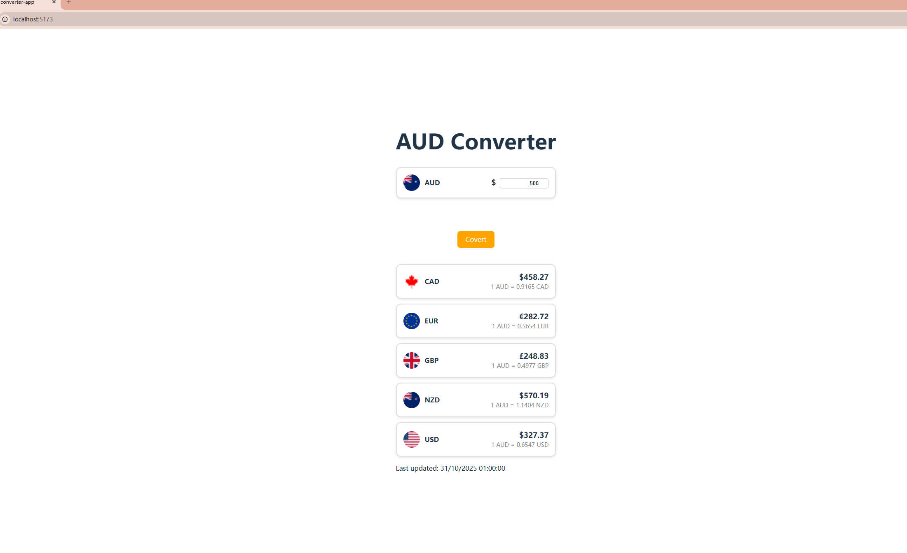
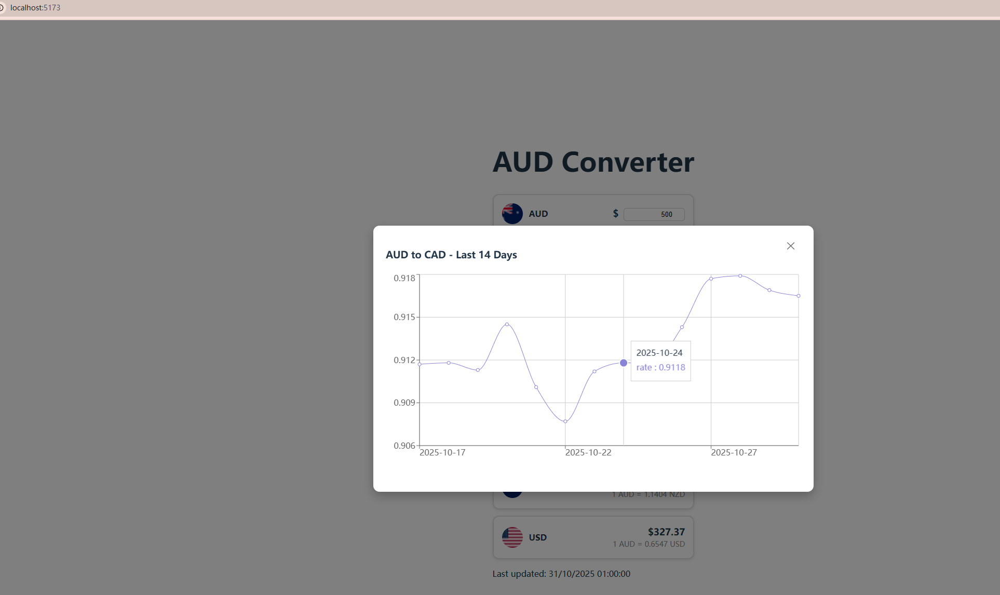

# Currency Converter App

A simple **React** web application that allows users to convert **AUD** to multiple currencies and view historical exchange rates for the last 14 days.

---

## Project Purpose

The goal of this project is to provide a user-friendly currency converter with **real-time and historical exchange rate data**. Users can:

- Input an amount in AUD.
- See converted amounts in multiple currencies.
- Click on a currency card to view a **14-day historical exchange rate chart** in a popup modal.

---

## Demo

Here are some screenshots from the demo:




---

## Technologies Used

- **React**: Front-end UI framework.
- **Vite**: Fast development server and build tool.
- **Axios**: For API requests.
- **Recharts**: To render interactive line charts.
- **Moment.js**: For date manipulation.
- **Docker**: Containerization for easy deployment.

---

## APIs Used

- **Open Exchange Rates**: `https://openexchangerates.org/api/`
  - **Latest Rates**: `latest.json`
  - **Historical Rates**: `historical/YYYY-MM-DD.json` 

> Make sure to provide your API key via environment variable `VITE_OXR_APP_ID` for local development and Docker.

---

## Installation

1. Clone the repository:

```bash
git clone <your-repo-url>
cd currency-converter-app
```

2. Install package:
```bash
npm install
```

3. Create and update your api key:
VITE_OXR_APP_ID=your_api_key_here

4. Play it: 
```bash
npm run dev
```

5. Docker:
```bash
docker build -t currency-converter-app .
docker run -p 80:80 currency-converter-app
```

